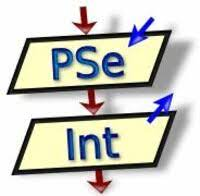

# ejercicios-pseint-
Ejercicios curso de programación Cepit  
  
***programación básica***  
*cepit* 

  

| Tema | Dificultad | 
| --- | --- |  
|variables |baja |
|vectores | alta |
|matrices | altas |
